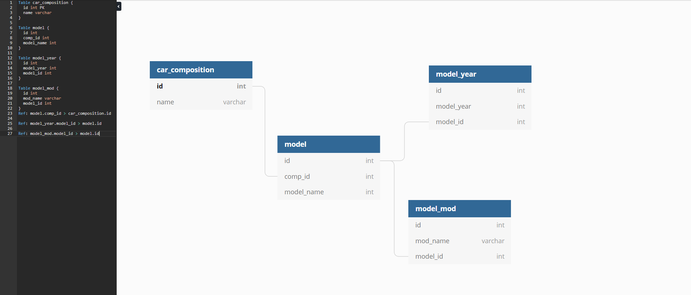

# test-task
1.Написать небольшое приложение, которое позволит пользователю загрузить на сайт изображение (не более 800*800px и 500Кб), добавить поверх свой текст (с выбором из пары-тройки шрифтов и цвета текста), а затем поделиться им в соцсети (fb, vk, twitter). Шарится ссылка, при переходе по которой откроется страница с указанной картинкой и предложением создать свою. В соцсети пост должен отображаться с тайтлом, описанием и этой самой картинкой.
Выполнять желательно на любом из фреймворков (yii2, laravel и т.д)  
2. Продумать схему БД, в которой будет храниться база моделей автомобилей с модификациями, по годам/поколениям. Примеры запросов: получить список модификаций последнего поколения bmw 5, получить список поколений mitsubishi lancer.	

получить список модификаций последнего поколения bmw 5  
SELECT MAX(model_year.year), cc.id FROM car_composition cc
INNER JOIN model ON model.comp_id = cc.id
INNER JOIN model_modifications ON model_modifications.model_id = model.id
INNER JOIN model_year ON model_year.model_id = model.id
WHERE cc.name = "BMW" AND model.model_name = "x5" 

получить список поколений mitsubishi lancer.  
SELECT * FROM car_composition cc
INNER JOIN model ON model.comp_id = cc.id
INNER JOIN model_modifications ON model_modifications.model_id = model.id
WHERE cc.name = "mitsubishi" AND model.model_name = "lancer"
